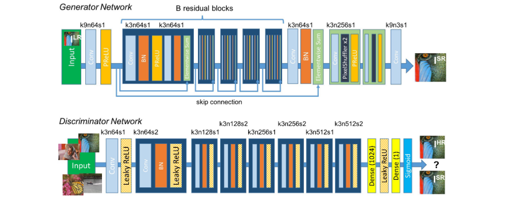

# SRGAN-pytorch
This repo is a pytorch implementation of 
[Photo-Realistic Single Image Super-Resolution Using a Generative Adversarial Network (SRGAN)](https://arxiv.org/abs/1609.04802) 
on [DIV2K dataset](https://data.vision.ee.ethz.ch/cvl/DIV2K/)

GANs, also known as Generative Adversarial Networks, are one of the most fascinating new developments in deep learning.
Yann LeCun saw GANs as "the most fascinating idea in the last 10 years in ML" when Ian Goodfellow and Yoshua Bengio from the University of Montreal first unveiled them in 2014.
GANS are frequently used to make deep fake films, improve the quality of images, face swap, design gaming characters, and much more. 


Super-resolution (SR) is upsampling a low-resolution image into a higher resolution with minimal information distortion. Since researchers had access to machines strong enough to compute vast amounts of data, significant progress has been made in the super-resolution field, with bicubic resizing, efficient sub-pixel nets, etc.
The idea of SRGAN was conceived by combining the elements of efficient sub-pixel nets, as well as traditional GAN loss functions. Before we dive deeper into this, Let’s first go through a brief recap of generative adversarial networks. 
The core concept of GANs is retained in SRGANs (i.e., the min-max function), which makes the generator and discriminator learn in unison by working against each other. SRGAN brings in a few of its own exclusive additions, built on previous research done in this field.
    The generator network employs residual blocks, where the idea is to keep information from previous layers alive and allow the network to choose from more features adaptively.
    Instead of adding random noise as the generator input, we pass the low-resolution image.

The discriminator network is pretty standard and works as a discriminator would work in a normal GAN.

The standout factor in SRGANs is the perceptual loss function. While the generator and discriminator will get trained based on the GAN architecture, SRGANs use the help of another loss function to reach their destination: the perceptual/content loss function.

The idea is that SRGAN designs a loss function that reaches its goal by also figuring out the perceptually relevant characteristics. So not only is the adversarial loss helping adjust the weights, but the content loss is also doing its part.

The content loss is defined as VGG loss, which means then a pretrained VGG network output is compared pixel-wise. The only way that the real image VGG output and the fake image VGG output will be similar is when the input images themselves are similar. The intuition behind this is that pixel-wise comparison will help compound the core objective of achieving super-resolution.

When the GAN loss and the content loss are combined, the results are really positive. Our generated super-resolution images are extremely sharp and reflective of their high-resolution (hr) counterparts. 

# Setup and Generate
This code is developed under following library dependencies
```commandline
python 3.8
torch 1.11.0
torchvision 0.12.0
```
Start with creating a virtual environment then open your terminal and follow the following steps:
```commandline
git clone "https://github.com/zaghlol94/SRGAN-pytorch"
cd SRGAN-pytorch
pip install -r requirements.txt
```
# Dataset and Train
## Dataset
 DIV2K dataset with DIVerse 2K resolution high quality images collected from Internet.
```commandline
src
  └── data
       └── DIV2K_train_HR
           ├── 0001.png
           ├── 0002.png
           ├── .
           ├── .
           └── 0800.png
```
## Training
Download DIV2K dataset and add the images' folder in ```src/data```
if you rename the root folder of the dataset don't forget to change the ````DATASET````
variable in [config.py](https://github.com/zaghlol94/SRGAN-pytorch/blob/main/src/config.py)
```commandline
cd src
python train.py
```
# Citation
````commandline
@misc{https://doi.org/10.48550/arxiv.1609.04802,
  doi = {10.48550/ARXIV.1609.04802},
  
  url = {https://arxiv.org/abs/1609.04802},
  
  author = {Ledig, Christian and Theis, Lucas and Huszar, Ferenc and Caballero, Jose and Cunningham, Andrew and Acosta, Alejandro and Aitken, Andrew and Tejani, Alykhan and Totz, Johannes and Wang, Zehan and Shi, Wenzhe},
  
  keywords = {Computer Vision and Pattern Recognition (cs.CV), Machine Learning (stat.ML), FOS: Computer and information sciences, FOS: Computer and information sciences},
  
  title = {Photo-Realistic Single Image Super-Resolution Using a Generative Adversarial Network},
  
  publisher = {arXiv},
  
  year = {2016},
  
  copyright = {arXiv.org perpetual, non-exclusive license}
}
````